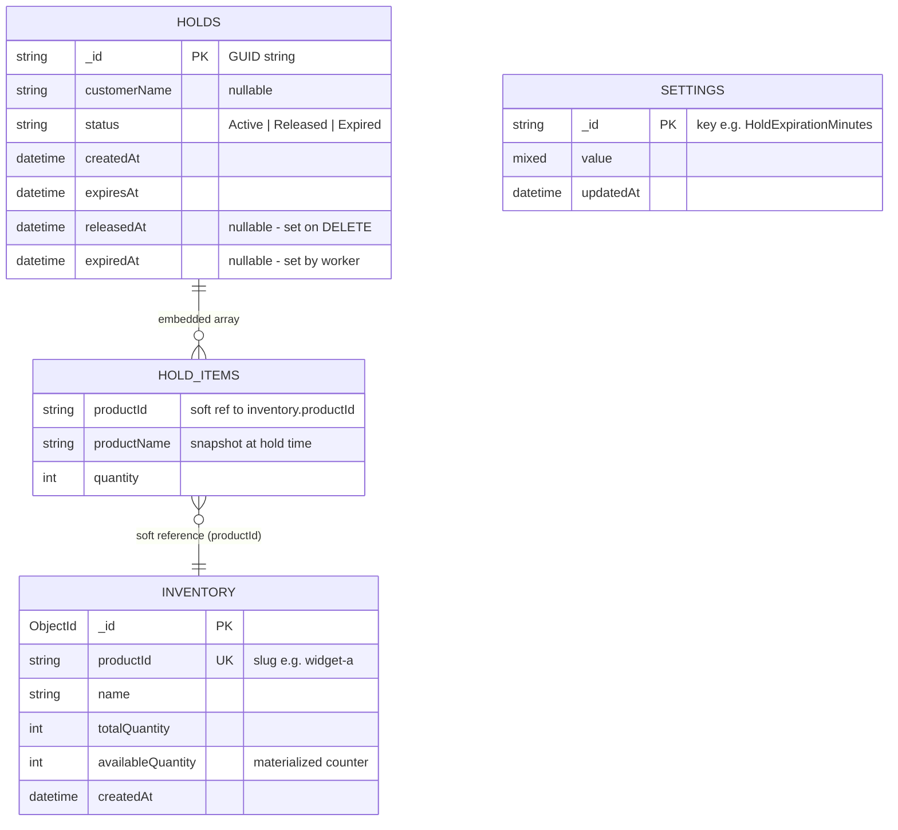

# Database Design — Inventory Hold Microservice

**Database:** MongoDB `inventory_hold_db`  
**Collections:** 3 (`holds`, `inventory`, `settings`)

---

## Entity Relationship Diagram



> **Soft reference:** MongoDB has no foreign keys. `hold_items.productId` logically references `inventory.productId` but is not enforced at DB level. Referential integrity is enforced in the application layer during hold creation (inside the transaction).

---

## Collection: `holds`

### Schema

```
holds
├── _id             String (GUID)          PK   e.g. "550e8400-e29b-41d4-a716-446655440000"
├── customerName    String?                      Optional. null if not provided
├── status          String                       "Active" | "Released" | "Expired"
├── items           Array<HoldItem>              Embedded. Min 1 element
│   ├── productId   String                       Matches inventory.productId
│   ├── productName String                       Denormalized snapshot at creation time
│   └── quantity    Int32                        ≥ 1
├── createdAt       DateTime (UTC)               Set at hold creation
├── expiresAt       DateTime (UTC)               createdAt + HoldExpirationMinutes
├── releasedAt      DateTime? (UTC)              Set by DELETE /api/holds/{id}
└── expiredAt       DateTime? (UTC)              Set by background expiry worker
```

### State Machine

```
                  POST /api/holds
                        │
                        ▼
                    [ Active ]
                   /          \
    DELETE (client)            Background worker
          │                         │
          ▼                         ▼
     [ Released ]             [ Expired ]
    releasedAt set            expiredAt set
```

- Transitions are **one-way** and **atomic** (`findOneAndUpdate` with `status: "Active"` guard)
- At most one of `releasedAt` / `expiredAt` is ever set per document

### Indexes

| Index | Fields | Type | Used By |
|-------|--------|------|---------|
| (default) | `_id` | unique | `GET /api/holds/{id}`, `DELETE /api/holds/{id}` |
| idx_status_expires | `{ status: 1, expiresAt: 1 }` | compound | Background worker query |
| idx_status_created | `{ status: 1, createdAt: -1 }` | compound | `GET /api/holds` list + sort |

### Sample Document

```json
{
  "_id": "550e8400-e29b-41d4-a716-446655440000",
  "customerName": "John Doe",
  "status": "Active",
  "items": [
    { "productId": "widget-a", "productName": "Widget A", "quantity": 2 },
    { "productId": "gadget-x", "productName": "Gadget X", "quantity": 1 }
  ],
  "createdAt": "2026-06-28T10:00:00Z",
  "expiresAt": "2026-06-28T10:15:00Z",
  "releasedAt": null,
  "expiredAt": null
}
```

---

## Collection: `inventory`

### Schema

```
inventory
├── _id                ObjectId              PK   Internal only. Never in API responses.
├── productId          String                UK   Public slug. e.g. "widget-a"
├── name               String                     Display name. e.g. "Widget A"
├── totalQuantity      Int32                      Set at seed. Never changes in this service.
├── availableQuantity  Int32                      Materialized counter. Mutated via atomic $inc.
└── createdAt          DateTime (UTC)             Seed timestamp.

[computed, not stored]
heldQuantity = totalQuantity - availableQuantity
```

### Quantity Flow

```
                    totalQuantity = 50 (fixed)
                         │
              ┌──────────┴──────────┐
              │                     │
     availableQuantity          heldQuantity
      (stored, atomic)         (computed: total - available)
              │
    ┌─────────┼─────────┐
    │         │         │
   -qty      +qty      +qty
    │         │         │
POST hold  DELETE hold  Worker expires hold
(create)   (release)    (expiry)
```

### Indexes

| Index | Fields | Type | Used By |
|-------|--------|------|---------|
| (default) | `_id` | unique | internal |
| idx_productid | `{ productId: 1 }` | unique | hold creation validation, `GET /api/inventory` |

### Invariants

- `0 ≤ availableQuantity ≤ totalQuantity` — always
- Never `$inc -qty` without first validating `availableQuantity >= qty` inside a transaction
- `$inc` operations are atomic — no separate read-modify-write cycle

### Seed Data

| productId | name | totalQuantity | availableQuantity |
|-----------|------|:---:|:---:|
| `widget-a` | Widget A | 50 | 50 |
| `widget-b` | Widget B | 30 | 30 |
| `gadget-x` | Gadget X | 20 | 20 |
| `device-z` | Device Z | 10 | 10 |
| `part-001` | Spare Part 001 | 100 | 100 |

`device-z` (qty 10) is intentionally low for stock-out demo scenarios.

### Sample Document

```json
{
  "_id": { "$oid": "6860a1b2c3d4e5f6a7b8c9d0" },
  "productId": "widget-a",
  "name": "Widget A",
  "totalQuantity": 50,
  "availableQuantity": 46,
  "createdAt": "2026-06-28T00:00:00Z"
}
```

> `heldQuantity` here = 50 - 46 = **4** (returned in API, never stored)

---

## Collection: `settings`

### Schema

```
settings
├── _id        String    PK   Key name. e.g. "HoldExpirationMinutes"
├── value      BsonValue      Heterogeneous. Int, string, bool depending on key.
└── updatedAt  DateTime       Last modified timestamp.
```

### Indexes

| Index | Fields | Type | Used By |
|-------|--------|------|---------|
| (default) | `_id` | unique | point lookup by key |

### Known Keys

| `_id` | Type | Default | Purpose |
|-------|------|---------|---------|
| `HoldExpirationMinutes` | Int32 | `15` | Minutes until a new hold expires |

### Fallback Chain

```
1. Redis cache (key: settings:expiration, TTL: 60s)
        ↓ miss
2. MongoDB settings collection (_id: "HoldExpirationMinutes")
        ↓ not found
3. appsettings.json → HoldSettings:ExpirationMinutes: 15
```

### Sample Document

```json
{ "_id": "HoldExpirationMinutes", "value": 15, "updatedAt": "2026-06-28T00:00:00Z" }
```

---

## Cross-Collection Operations

### POST /api/holds (Multi-Document Transaction)

```
BEGIN TRANSACTION
  ┌─ READ inventory for each item.productId  ─┐
  │  → 404 if product not found               │  Phase 1
  │  → 409 if availableQuantity < requested   │  (validate all)
  └───────────────────────────────────────────┘
  ┌─ $inc availableQuantity -qty per item     ─┐
  │  insertOne hold document                   │  Phase 2
  └───────────────────────────────────────────┘  (write all)
COMMIT
```

On `MongoCommandException` code 112 (WriteConflict): retry up to 3× with 50ms exponential backoff → 409 after exhaustion.

### DELETE /api/holds/{id} (Atomic + Sequential)

```
findOneAndUpdate({ _id, status:"Active" }, { $set: Released })
       │
  null ─→ find({ _id }) ─→ null: 404  |  found: 410
       │
  doc  ─→ $inc availableQuantity +qty per item
       ─→ publish HoldReleased
       ─→ invalidate Redis cache
```

### Background Worker (every 30s)

```
find({ status:"Active", expiresAt: { $lte: now } })   ← uses idx_status_expires
  for each hold:
    findOneAndUpdate({ _id, status:"Active" }, { $set: Expired })
      if won race:
        $inc availableQuantity +qty per item
        publish HoldExpired
  if any expired → invalidate Redis inventory:all cache
```

---

## Redis Cache Keys (reference)

| Key | Value | TTL | Invalidated On |
|-----|-------|-----|----------------|
| `inventory:all` | Full inventory list JSON | 30s | Any hold mutation |
| `hold:{holdId}` | Single hold JSON | 60s | Hold state change |
| `settings:expiration` | Int (minutes) | 60s | Settings change |
