# High-Level Design — Inventory Hold Microservice

## Table of Contents
1. [System Overview](#1-system-overview)
2. [Architecture](#2-architecture)
3. [Project Structure](#3-project-structure)
4. [API Endpoints](#4-api-endpoints)
5. [Scenario: Create Hold](#5-scenario-create-hold)
6. [Scenario: Insufficient Stock](#6-scenario-insufficient-stock)
7. [Scenario: Concurrent Write Conflict](#7-scenario-concurrent-write-conflict)
8. [Scenario: Get Hold](#8-scenario-get-hold)
9. [Scenario: Release Hold](#9-scenario-release-hold)
10. [Scenario: Hold Expiry (Background Worker)](#10-scenario-hold-expiry-background-worker)
11. [Scenario: Worker vs Client Race Condition](#11-scenario-worker-vs-client-race-condition)
12. [Scenario: Get Inventory (Cache)](#12-scenario-get-inventory-cache)
13. [RabbitMQ Event Flow](#13-rabbitmq-event-flow)
14. [Health Check](#14-health-check)
15. [Seed & Reset](#15-seed--reset)
16. [Non-Functional Requirements](#16-non-functional-requirements)

---

## 1. System Overview

The Inventory Hold Microservice allows e-commerce clients to temporarily reserve stock during checkout. A hold atomically deducts `availableQuantity` from inventory, expires after a configurable window (default 15 min), and publishes lifecycle events to RabbitMQ for downstream services.

**Tech Stack**

| Layer | Technology |
|-------|-----------|
| API | .NET 10, ASP.NET Core Minimal API |
| Domain | C# 12, DDD (Entities, Repositories, Domain Services) |
| Database | MongoDB 7 (holds, inventory, settings) |
| Cache | Redis 7 (inventory, single hold, settings) |
| Messaging | RabbitMQ 3 (direct exchange, 3 queues) |
| Frontend | React 18, TypeScript, Vite, TanStack Query, Zustand |
| Reverse Proxy | Nginx (serves frontend, proxies `/api/*` to .NET) |
| Container | Docker + docker-compose |
| Testing | xUnit, Moq, FluentAssertions |

---

## 2. Architecture

### System Architecture

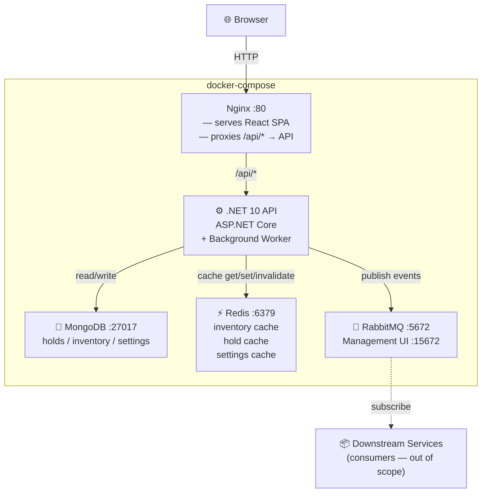

### Component Diagram

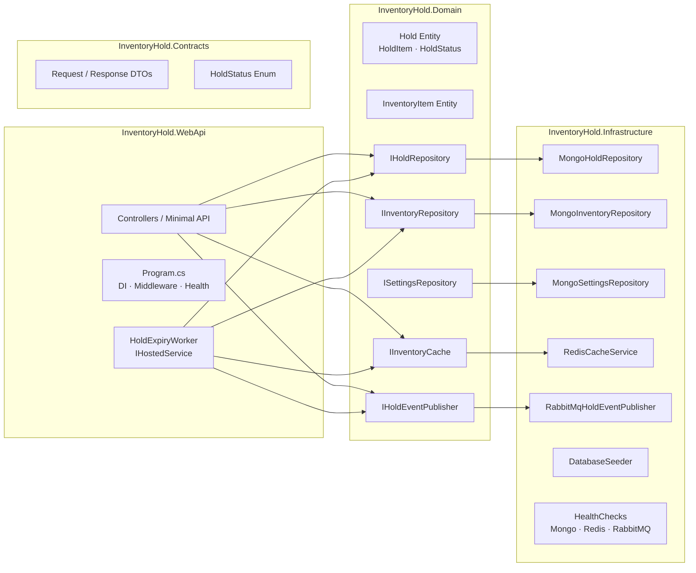

---

## 3. Project Structure

```
src/
├── InventoryHold.Contracts/
│   ├── Requests/
│   │   └── CreateHoldRequest.cs        # { customerName?, items[] }
│   └── Responses/
│       ├── HoldResponse.cs             # Full hold DTO
│       ├── InventoryResponse.cs        # { productId, name, total, available, held }
│       └── PagedResponse.cs            # { data[], total, page, pageSize, totalPages }
│
├── InventoryHold.Domain/
│   ├── Entities/
│   │   ├── Hold.cs                     # Aggregate root
│   │   ├── HoldItem.cs                 # Value object (embedded)
│   │   ├── HoldStatus.cs              # Enum: Active | Released | Expired
│   │   ├── InventoryItem.cs
│   │   └── AppSetting.cs
│   ├── Repositories/
│   │   ├── IHoldRepository.cs
│   │   ├── IInventoryRepository.cs
│   │   └── ISettingsRepository.cs
│   ├── Messaging/
│   │   └── IHoldEventPublisher.cs
│   └── Cache/
│       └── IInventoryCache.cs
│
├── InventoryHold.Infrastructure/
│   ├── Persistence/
│   │   ├── MongoHoldRepository.cs
│   │   ├── MongoInventoryRepository.cs
│   │   ├── MongoSettingsRepository.cs
│   │   ├── DatabaseSeeder.cs
│   │   └── CollectionIndexInitializer.cs
│   ├── Messaging/
│   │   ├── RabbitMqConnectionFactory.cs
│   │   ├── RabbitMqTopologyInitializer.cs
│   │   ├── RabbitMqHoldEventPublisher.cs
│   │   └── Events/                     # HoldCreatedEvent, HoldReleasedEvent, HoldExpiredEvent
│   ├── Caching/
│   │   └── RedisCacheService.cs
│   └── HealthChecks/
│       └── RabbitMqHealthCheck.cs
│
├── InventoryHold.WebApi/
│   ├── Endpoints/                      # Minimal API endpoint definitions
│   ├── Workers/
│   │   └── HoldExpiryWorker.cs        # IHostedService — 30s poll
│   ├── Middleware/
│   │   └── ExceptionMiddleware.cs     # → RFC 7807 ProblemDetails
│   └── Program.cs
│
├── InventoryHold.UnitTests/
│   ├── HoldServiceTests.cs
│   ├── HoldExpiryWorkerTests.cs
│   └── ConcurrencyTests.cs
│
frontend/                               # React + TypeScript + Vite
docker-compose.yml
nginx/nginx.conf
```

---

## 4. API Endpoints

| Method | Path | Description | Success | Errors |
|--------|------|-------------|---------|--------|
| `POST` | `/api/holds` | Create a hold | `201 Created` | `404` (product), `409` (stock/conflict), `422` (validation) |
| `GET` | `/api/holds` | List holds (filter + page) | `200 OK` | — |
| `GET` | `/api/holds/{holdId}` | Get single hold | `200 OK` | `404` (never existed) |
| `DELETE` | `/api/holds/{holdId}` | Release a hold | `200 OK` (with body) | `404`, `410` (terminal) |
| `GET` | `/api/inventory` | All inventory levels | `200 OK` | — |
| `POST` | `/api/inventory/reset` | Reset to seed state | `200 OK` | — |
| `GET` | `/health` | Dependency health | `200`/`503` | — |
| `GET` | `/swagger` | Swagger UI | `200 OK` | — |

### Query Parameters — GET /api/holds

| Param | Type | Default | Constraint |
|-------|------|---------|-----------|
| `status` | `active\|released\|expired` | `active` | optional |
| `page` | int | `1` | ≥ 1 |
| `pageSize` | int | `20` | 1–100; `422` if > 100 |

---

## 5. Scenario: Create Hold

**POST /api/holds** — Happy path with 2 items, both in stock.

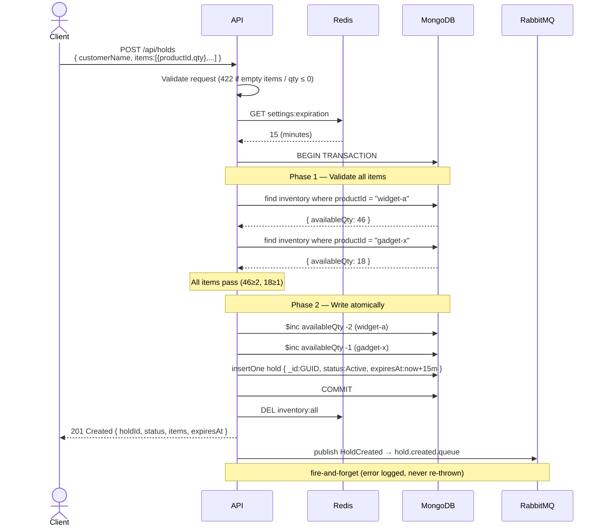

---

## 6. Scenario: Insufficient Stock

**POST /api/holds** — One item has insufficient stock.

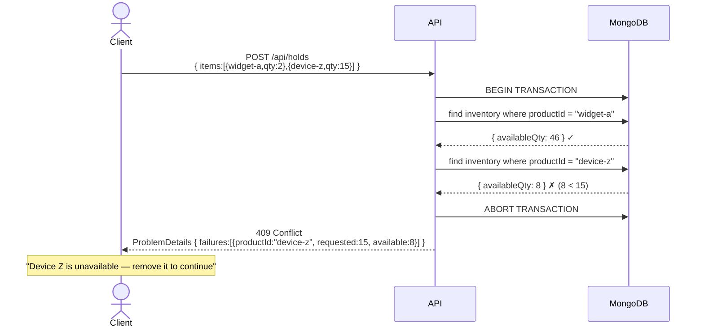

---

## 7. Scenario: Concurrent Write Conflict

**POST /api/holds** — Two clients race for the last unit of device-z (qty 1).

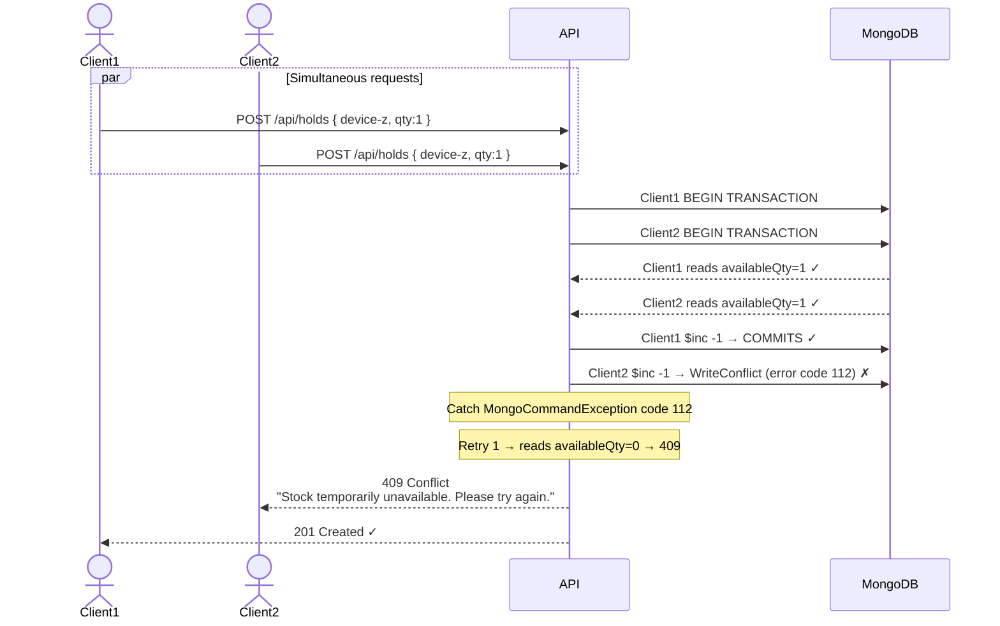

**Retry strategy:** Up to 3 attempts with 50ms exponential backoff. Only retries on code 112 — all other exceptions propagate immediately.

---

## 8. Scenario: Get Hold

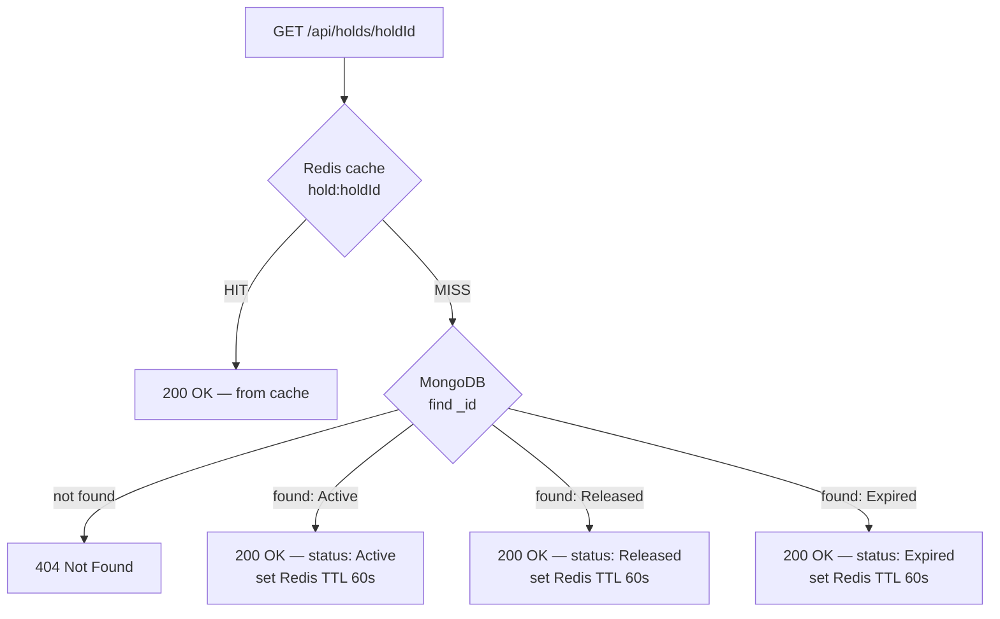

> **Rule:** GET always returns 200 with semantic `status` for documents that exist. Only DELETE returns 410 for terminal states.

---

## 9. Scenario: Release Hold

**DELETE /api/holds/{holdId}** — All cases.

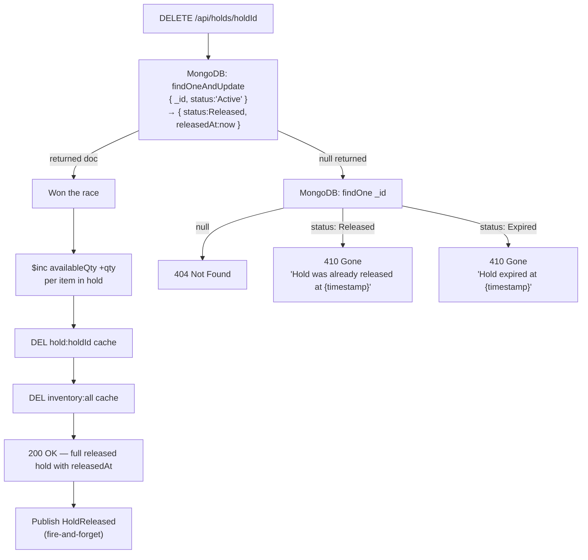

---

## 10. Scenario: Hold Expiry (Background Worker)

**HoldExpiryWorker** runs every 30 seconds (configurable via `HoldSettings:PollingIntervalSeconds`).

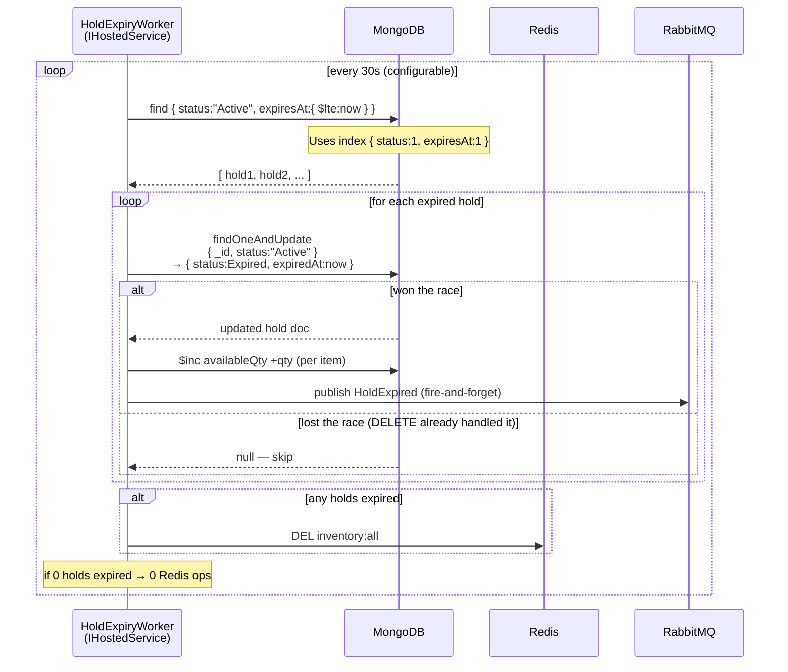

---

## 11. Scenario: Worker vs Client Race Condition

Background worker and client DELETE both attempt to expire/release the same hold at the same instant.

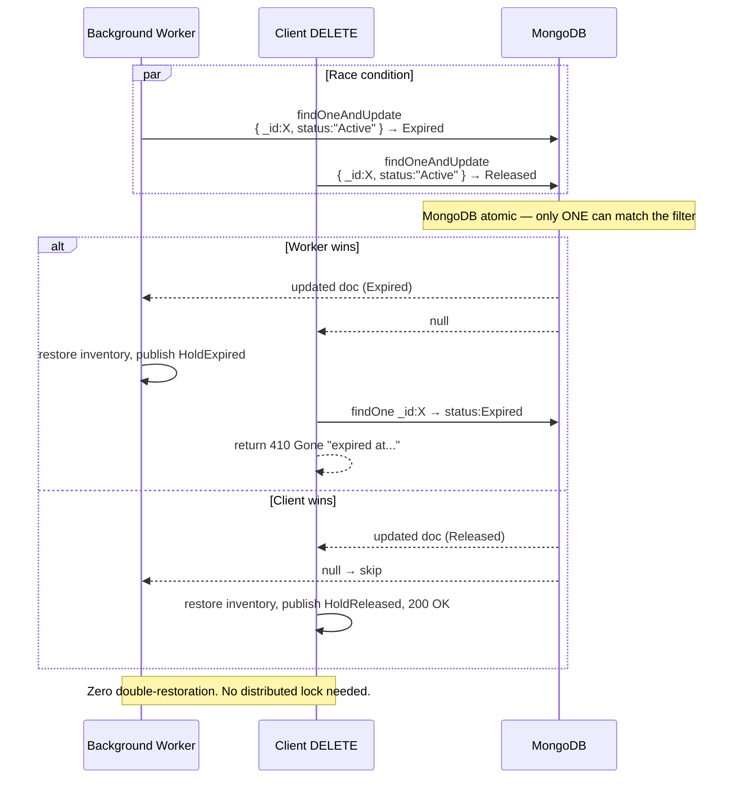

---

## 12. Scenario: Get Inventory (Cache)

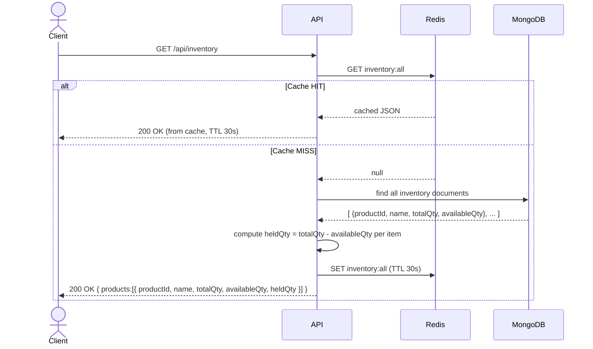

**Cache invalidated on:** `POST /api/holds` (create), `DELETE /api/holds/{id}` (release), background worker expiry, `POST /api/inventory/reset`.

---

## 13. RabbitMQ Event Flow

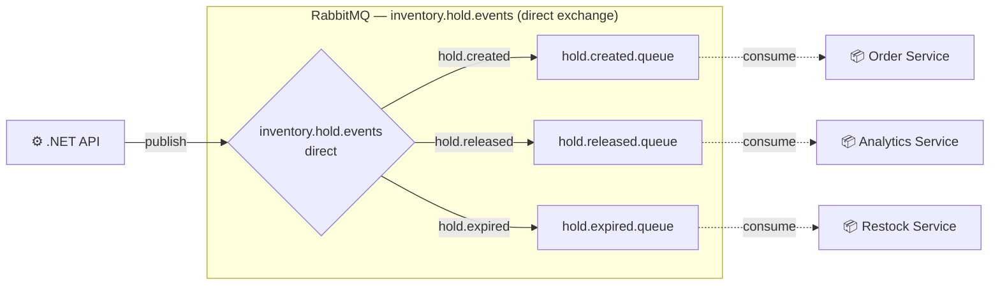

**Event payloads:**

| Event | Routing Key | Key Fields |
|-------|------------|-----------|
| `HoldCreated` | `hold.created` | holdId, customerName, status, items[], createdAt, expiresAt |
| `HoldReleased` | `hold.released` | holdId, customerName, status, items[], releasedAt |
| `HoldExpired` | `hold.expired` | holdId, customerName, status, items[], expiredAt |

**Failure handling:** Fire-and-forget — logged at `Error`, HTTP response not affected. Trade-off: favours checkout availability over guaranteed delivery.

---

## 14. Health Check

**GET /health** — checked by docker-compose `depends_on: service_healthy`.

```mermaid
flowchart LR
    A[GET /health] --> B[MongoDB ping]
    A --> C[Redis ping]
    A --> D[RabbitMQ connection.IsOpen]
    B & C & D --> E{All healthy?}
    E -->|yes| F[200 OK\n{ status:Healthy }]
    E -->|any fail| G[503 Unhealthy\n{ status:Unhealthy, details:{...} }]
```

**Startup order (docker-compose):**
```
MongoDB healthy → Redis healthy → RabbitMQ healthy → API starts
```

---

## 15. Seed & Reset

### Startup Seeding
```
On API startup:
  if inventory.count == 0:
    insert 5 products (widget-a:50, widget-b:30, gadget-x:20, device-z:10, part-001:100)
  else:
    skip (preserves demo state across restarts)
```

### POST /api/inventory/reset
```
1. Delete all hold documents
2. Restore all inventory.availableQuantity = totalQuantity
3. Flush Redis (DEL inventory:all, all hold:{id} keys)
4. Return 200 OK { message: "Reset complete", products: [...] }
```

---

## 16. Non-Functional Requirements

### Concurrency Safety
- Multi-document MongoDB transactions for hold creation (atomic deduct across products)
- `findOneAndUpdate` with `status: "Active"` guard for release and expiry (prevents double-restoration)
- Write conflict retry: 3× with 50ms exponential backoff → 409

### Error Responses
- All errors return RFC 7807 `ProblemDetails`
- Domain errors (409 insufficient stock) include extension fields: `failures[]`
- No stack traces or internal details exposed to clients

### HTTP Status Code Contract

| Code | Meaning | When |
|------|---------|------|
| 201 | Created | Hold successfully placed |
| 200 | OK | GET / DELETE success |
| 404 | Not Found | holdId / productId never existed |
| 409 | Conflict | Insufficient stock or write conflict exhausted |
| 410 | Gone | Hold exists but in terminal state (Released or Expired) |
| 422 | Unprocessable | Validation failure (empty items, qty ≤ 0, pageSize > 100) |
| 503 | Unavailable | Health check failure |

### Caching Strategy

| Key | TTL | Invalidated On |
|-----|-----|----------------|
| `inventory:all` | 30s | Any hold mutation |
| `hold:{holdId}` | 60s | Hold state change |
| `settings:expiration` | 60s | Settings update |
| `GET /api/holds` list | **Not cached** | Too dynamic; invalidation cost > read benefit |

### Frontend Sync
- TanStack Query `invalidateQueries` after every mutation — inventory and holds list refresh automatically
- Client-computed countdown from `expiresAt` ISO timestamp via `setInterval`
- On countdown hit 0: refetch to confirm expiry (worker may not have run yet)

### Frontend Error UX

| Error Type | Display |
|-----------|---------|
| Form validation (422) | Inline below field |
| Domain error (409, 404) | Inline banner with `ProblemDetails.detail` message |
| Network / 500 | Toast notification (auto-dismiss) |
| Loading states | Skeleton on lists, spinner on action buttons (`isPending`) |

### Testing
- Minimum 5 xUnit tests
- All infrastructure mocked (IHoldRepository, IInventoryCache, IHoldEventPublisher)
- Must cover: validation, hold lifecycle, concurrency / edge cases
- No running infrastructure required for tests
